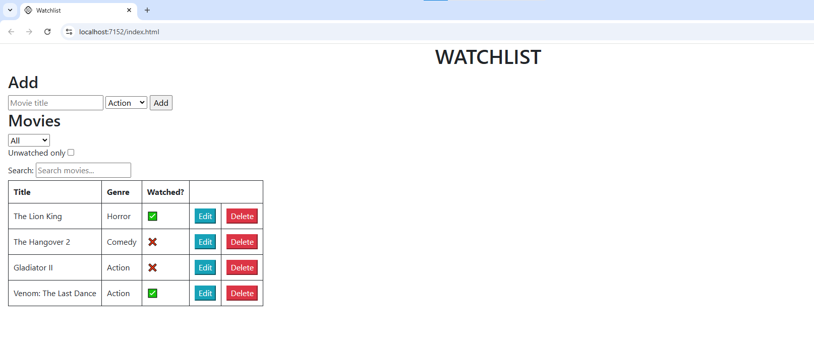

# WatchlistApp (Web App)
Personal Web project

- CRUD
- ASP.NET
- .NET 9
- Backend (Controller based API, RESTful, Swagger/OpenAPI documentation)
- Frontend/UI (HTML, CSS + Boostrap, vanilla JavaScript)
- Search filter (Regex)
- Genre filter (LINQ)
- Relational Database (SQL Server)
- ORM (Entity Framework Core, Migrations, Code-First)

## Screenshot (Static Web UI):

## YouTube Demo (Razor Pages Web App + jQuery + Bootstrap):
*Uses .Api proj and VS Multiple startup

